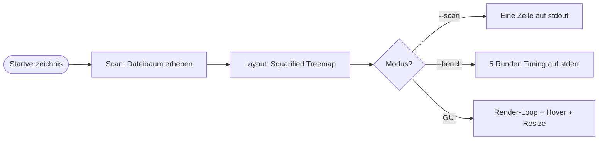
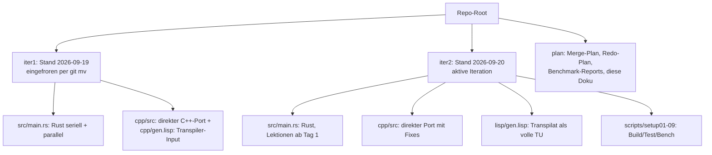
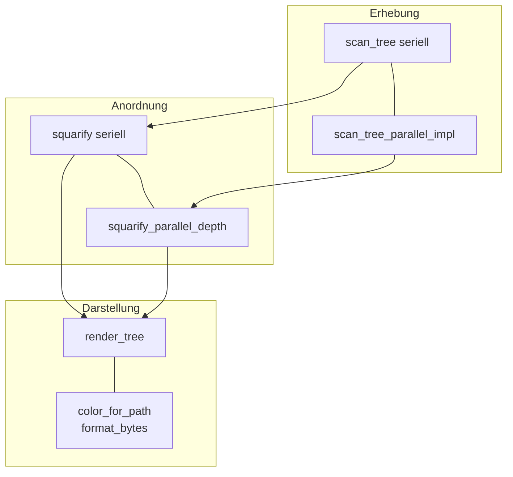
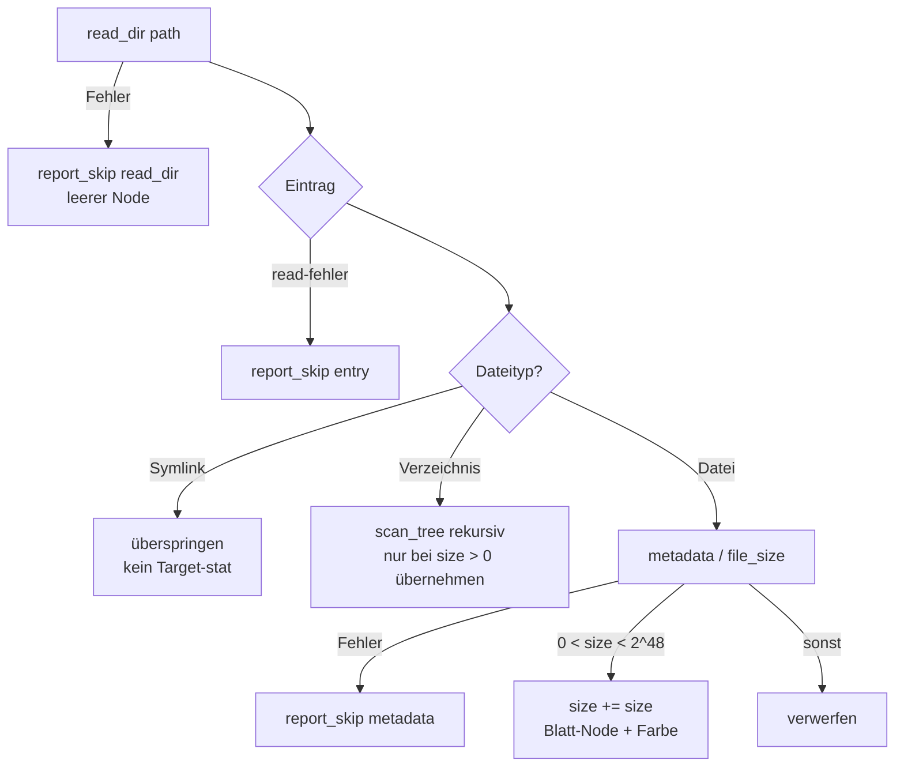
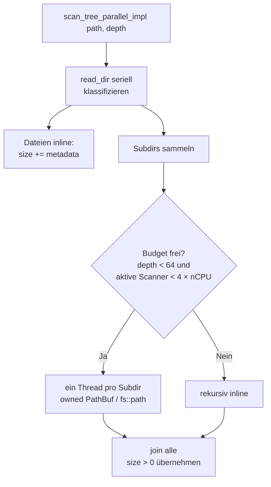
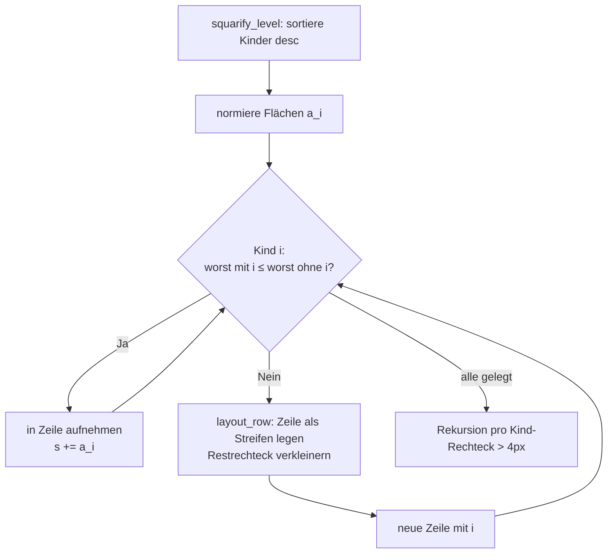
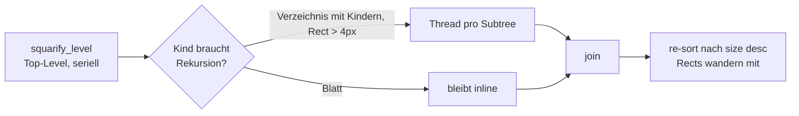

# Treemap-Disk-Visualizer: Architektur, Datenerhebung, Layout und Benchmarks

Technische Dokumentation der Code-Experimente in diesem Repository:
zwei Iterationen (``iter1/``, ``iter2/``) je einer Rust-Implementierung und
zweier C++-Implementierungen (direkt portiert, per Lisp transpiliert),
inklusive der Benchmark-Experimente zur Parallelisierung.

Quellen im Repo: [iter1/src/main.rs](../../../iter1/src/main.rs),
[iter2/src/main.rs](../../../iter2/src/main.rs),
[iter1/cpp/src](../../../iter1/cpp/src),
[iter2/cpp/src](../../../iter2/cpp/src),
[iter2/lisp/gen.lisp](../../../iter2/lisp/gen.lisp),
Walkthroughs und Reports unter
[plan/20260919_01_merge](../../20260919_01_merge/walkthrough.md) und
[plan/20260920_01_redo](../../20260920_01_redo/walkthrough.md).

---

## 1. Überblick: Was das Programm tut

Der Treemap-Disk-Visualizer misst die Größen aller Dateien unter einem
Startverzeichnis und zeichnet sie als **Treemap**: Jedes Rechteck steht für
eine Datei (oder ein Verzeichnis), seine Fläche ist proportional zur
Byte-Größe. Drei Betriebsarten, ganz ohne GUI-Overhead testbar:

| Modus | Befehl | Verhalten |
|---|---|---|
| Scan (headless) | `--scan <dir>` | eine Zeile `Pfad: Größe in N Dateien`, Broken-Pipe-sicher |
| Benchmark | `--bench <dir>` | 5 Runden seriell vs. parallel (Scan + Layout), Paritäts-Assert |
| GUI | `<binary> [dir]` | paralleler Scan im Hintergrund-Thread, Treemap mit Hover-Anzeige |

Beide Iterationen teilen diese Pipeline. Der Unterschied liegt in der
**Reife der Parallelisierung und des C++-Ports** (§ 2), nicht in der
Benutzeroberfläche.

### Repository-Layout

| Aspekt | Iteration 1 (`iter1/`) | Iteration 2 (`iter2/`) |
|---|---|---|
| Rust | seriell + parallel (`thread::scope`); Cap nachgerüstet | gleiche Architektur, Cap/`depth`/Helfer von Anfang an |
| C++ direkt | Port mit 3 Stats/Datei und unbegrenztem Fan-out, per Bench gefixt | Fixes übernommen: 1 Stat/Datei, Pfade by value, `needs_recursion` |
| C++ generiert | `gen.lisp`-Input, nur Syntax-Check, ungeprüfte Defekte | volle Translation Unit, kompiliert, byte-identisch, Kanten-Tests |
| Tests | Unit + Headless | + Missing-Dir-, Broken-Pipe- und Paritätstests; Skripte `setup01`–`setup09` |
| Benchmarks | Fixture + ein großer Baum | Fixture + `/workspace`, `/root`, `/usr`; Rust↔C++-Report |

---

## 2. Architektur: drei Schichten, zwei Sprachen, ein Vertrag

Alle vier Programme (Rust/C++ × iter1/iter2) implementieren denselben
Datenvertrag:

- **Daten:** `Node { path, size, is_dir, children, rect, color }` — ein Baum
  aus *Owned Values*, keine Referenzen über Thread-Grenzen.
- **Serieller Pfad (Referenz):** `scan_tree` / `scan_entry`, `worst` /
  `layout_row` / `squarify`, `render_tree`, `color_for_path`, `format_bytes`.
- **Paralleler Pfad:** `scan_tree_parallel_impl(path, depth)`,
  `squarify_parallel_depth(nodes, rect, depth)` — gleiche Algorithmen,
  Subtrees wandern als Owned Values in Threads.
- **Fehler:** genau eine Meldefunktion (`report_skip`), kein `unwrap`/keine
  Exception auf E/A-Pfaden.

### 2.1 Wie Rust und C++ denselben Vertrag erfüllen

Jede Rust-Funktion hat ein 1:1-Gegenstück mit snake_case-Namen, sodass man
beide Dateien nebeneinander lesen kann. Was anders gemacht werden musste:

| Mechanismus | Rust | C++ (beide Iterationen) |
|---|---|---|
| Thread-Scope | `std::thread::scope` joint automatisch | `std::vector<std::thread>` + Join-Schleife im selben Scope, keine frühen Returns |
| Fan-out-Budget | implizit durch Scope-Typ | handgeschrieben: atomarer Zähler `ScanWorkersActive`, Limit `4 × nCPU` |
| Fehler | `Result` zwingt zur Behandlung | `std::error_code`-Out-Parameter an jeder Filesystem-Stelle, jede Stelle prüft + `report_skip` (stderr unter Mutex) |
| Ownership über Threads | Borrowchecker beweist Disjunktheit | `std::move` + disjunkte `results[i]`-Slots; Korrektheit steckt in der Join-Reihenfolge |
| Dateityp | `file_type()` (d_type, 0 Syscalls) | `is_symlink`/`is_directory`/`is_regular_file` (libstdc++-Cache, 1 Stat) — iter1 lehrte: naive `status()`-Kette = 3 Stats |
| Ordnung nach Join | `sort_unstable_by_key(Reverse(size))` | `std::sort` nach Join — Threads kehren in Fertigstellungsreihenfolge zurück, Rects wandern mit |
| GUI-Backend | macroquad | olcPixelGameEngine (vendored Header, `030_pge_app.hpp`) |

Sicherheit wird in C++ **nicht vererbt, sondern diszipliniert ersetzt**:
gleiche Struktur (kleine Review-Fläche) + Sanitizer-Builds (ASan/UBSan für
Tests) + Byte-Paritätstests. Sanitizer-Builds sind 3–5× langsamer —
Bench-Zahlen gelten nur für sanitize-freie Builds.

### 2.2 Unterschiede Iteration 1 → 2 im Code

Die Rust-Programme sind algorithmisch identisch; iter2 faktorisiert Helfer
heraus (`is_virtual`, `dir_node`, `file_node`) und trägt Cap/`depth` von
Anfang an statt als Bench-Fix. Die sichtbaren C++-Änderungen:

1. **Pfade by value statt `const&`** (`010_scanner.hpp`): iter1 band
   `const fs::path& p = entry.path();` an Iterator-Interna — legal, aber jede
   Schleifen-Refaktorierung konnte daraus ein Dangling machen. iter2 kopiert
   (`const fs::path p = entry.path();`), auf beiden Scan-Pfaden.
   Tidy-Regel `bugprone-dangling-handle` bleibt Pflicht.
2. **`ScanWorkerLimit` ohne Underflow-Falle:** iter1 rechnete
   `std::max(2u, hw == 0 ? …)` mit vorzeichenloser Arithmetik; iter2 liest
   `hardware_concurrency()` erst in eine lokale Variable und sichert `hw == 0`
   explizit ab.
3. **`needs_recursion`-Helfer** (`020_layout.hpp`): die vierfache Bedingung
   (Verzeichnis, nicht leer, Rechteck > 4 px) steht einmal statt an jeder
   Verzweigung.
4. **Transpilat als volle Translation Unit:** iter1-Generat kompilierte nur
   per `g++ -fsyntax-only`; iter2-Generat baut beide CMake-Presets, besteht
   `ctest` und ist `--scan`-byte-identisch. Dabei flog ein echter Bug auf:
   `defstruct0` ignoriert Init-Forms → `isDir` ohne Default → Missing-Dir
   meldete `in 1 files` statt `in 0 files` (Fix: explizite Zuweisung im
   Emitter; Paritätstest sichert das ab).

---

## 3. Datenerhebung: der Filesystem-Scan

Der Scan ist die einzige Schicht, die das Betriebssystem berührt — und die
einzige, deren Laufzeit zählt (Layout: Millisekunden, Scan: Zehntelsekunden
bis Sekunden). Sein Konzept ist in allen vier Programmen gleich:

### 3.1 Serieller Referenz-Scan

`scan_tree(path)` öffnet **ein** Verzeichnis (`read_dir` /
`directory_iterator`), klassifiziert jeden Eintrag und rekursiert in
Unterverzeichnisse. Die Größen werden bottom-up aufsummiert: Ein Verzeichnis
zählt genau dann, wenn seine aufsummierte Größe $> 0$ ist; leere Dateien
(`size == 0`) und absurde Größen ($\geq 2^{48}$) fallen heraus.

Drei Filter sind semantisch, nicht kosmetisch:

- **Symlinks werden nie verfolgt** — sonst drohen Zyklen und doppelt
  gezählte Bäume. Entscheidend: Der Symlink-Test läuft *vor* jedem
  Target-stat (Rust: `file_type()` löst nicht auf; C++: `is_symlink` zuerst).
- **`/proc`, `/sys`, `/dev` sind ausgenommen** (`is_virtual`): virtuelle
  Bäume ändern sich während des Lesens und sind unendlich tief.
- **Fehler sind Werte, kein Abbruch:** Jede E/A-Stelle meldet über
  `report_skip` genau einmal nach stderr und läuft mit Defaults weiter.
  `--scan` auf ein fehlendes Verzeichnis liefert `0.0 B in 0 files`, Exit 0.

### 3.2 Der Single-Stat-Punkt: warum der C++-Port erst langsam war

Der teuerste Unterschied zwischen den Sprachen steckt in *einer* Zeile:
der Dateityp-Abfrage. Rusts `file_type()` beantwortet der Kernel direkt aus
dem `readdir`-Eintrag (`d_type`) — **0 zusätzliche Syscalls**. Der erste
C++-Port fragte naiv `status()` + `symlink_status()` + `file_size()`:
**3 Stats pro Datei**, per `strace` belegt (13.421 → 6.264 Syscalls auf dem
Testbaum), **5,6× langsamer** als Rust. Der Fix nutzt den libstdc++-Cache
`is_symlink` / `is_directory` / `is_regular_file` → **1 Stat pro Datei**,
danach Parität. Merksatz für die Doku:

$$
\text{Scan-Zeit} \approx N_{\text{Einträge}} \times
(\text{Syscalls pro Eintrag}) \times t_{\text{Syscall}} +
\text{Thread-Overhead}
$$

mit $N$ im Hunderttausender-Bereich dominiert der erste Term alles —
jede überflüssige `stat`-Familie kostet linear.

### 3.3 Paralleler Scan: Dateien inline, Threads pro Verzeichnis

Die Granularitätswahl ist das zentrale Ergebnis der iter1-Benchmarks:
**Thread-pro-Datei war 12× langsamer** (0,009 s → 0,108 s auf dem Fixture).
Dateien sind billig (ein `stat`), Verzeichnisse sind teuer (ganze Subtrees).
Deshalb behandelt der parallele Pfad Dateien **inline** und fächert nur
über **Unterverzeichnisse** auf — jede Ebene liest ihre Eintragsliste
weiterhin seriell, nur die Subtrees laufen nebenläufig:

Implementierung: Rust nutzt `thread::scope` über Owned Values; C++ nutzt
`std::thread`s mit disjunkten `results[i]`-Slots und Join-Schleife im selben
Scope. Das Budget (`SCAN_ACTIVE` / `ScanWorkersActive`, Limit $4 \times
\text{nCPU}$) verhindert Thread-Explosion: **Unbegrenztes Spawnen maß auf
warmem Cache 0,97×** — Parallelität ohne Cap war langsamer als seriell.

Formal gilt für den erreichbaren Speedup mit $p$ Worker-Threads und
seriellem Listen-Anteil $s$ (Amdahl):

$$
S(p) = \frac{T_{\text{seriell}}}{T_{\text{parallel}}} \le
\frac{1}{s + \frac{1 - s}{p}}, \qquad
\lim_{p \to \infty} S(p) = \frac{1}{s}
$$

Da jede Verzeichnisebene seriell gelistet wird und der Scan VFS-gebunden
ist (nicht CPU-gebunden), ist $s$ groß — $S \approx 1{,}5$–$2{,}5$ ist das
erwartbare Optimum dieser Architektur, keine 8× (siehe § 5).

---

## 4. Layout: Squarified Treemap

Das Layout folgt Bruls, Huizing und van Wijk („Squarified Treemaps"):
Kinder werden größenabsteigend sortiert und zeilenweise so auf das
Restrechteck gelegt, dass die Rechtecke möglichst **quadratisch** bleiben.
Pro Ebene läuft ein serieller Zeilenpass (`squarify_level`), danach
rekursiert das Verfahren in jedes Verzeichnis-Rechteck größer als 4 px.

### 4.1 Die Kernidee als Formel

Sei $W$ die kurze Seite des Restrechtecks, $s$ die Flächensumme der
aktuellen Zeile und $a_i$ die (normierte) Fläche von Kind $i$. Das
schlechteste Seitenverhältnis der Zeile ist

$$
\mathrm{worst}(Zeile) = \max_i \;
\max\!\left( \frac{W^2 \cdot a_i}{s^2},\, \frac{s^2}{W^2 \cdot a_i} \right)
$$

(`worst` / `worst_aspect`). Ein Kind kommt genau dann in die laufende Zeile,
wenn es $\mathrm{worst}$ **nicht verschlechtert** — sonst wird die Zeile
gelegt (`layout_row`: Streifen der Dicke $s / W$ entlang der kurzen Seite)
und eine neue begonnen. Die Flächen-Normierung ist

$$
a_i = \mathrm{size}_i \cdot \frac{W_{\text{canvas}} \cdot H_{\text{canvas}}}
{\sum_j \mathrm{size}_j},
\qquad \sum_i a_i = W_{\text{canvas}} \cdot H_{\text{canvas}}
$$

also **flächentreu**: Die Summe aller Kind-Rechtecke füllt den Canvas bis auf
Rundung exakt aus (Test-Toleranz < 0,5 %).

### 4.2 Paralleles Layout: nur die oberste Ebene fächert auf

Der Zeilenpass ist inhärent seriell (jede Entscheidung hängt vom
Restrechteck ab). Parallel läuft nur die **Rekursion in die Subtrees** —
und auch das nur auf der obersten Ebene (`depth == 0`): Blätter ohne
Rekursionsbedarf bleiben inline, Subtrees wandern als Owned Values in
Threads. Danach wird die Größenordnung wiederhergestellt, weil Threads in
Fertigstellungsreihenfolge zurückkehren:

Warum Top-Level-only? **Unbegrenzter Fan-out auf jeder Ebene maß 5×
langsamer als seriell** (iter1-Bench): Das Layout ist Millisekunden-Arbeit,
Thread-Spawns kosten mehr als sie bringen. Der parallele Layout-Pfad ist
daher ein Korrektheits-Parallelismus (gleiche Rechtecke wie seriell), kein
Speed-Claim — auf großen Bäumen immerhin ~2× (6 ms → 3 ms, 30 ms → 15 ms).

### 4.3 Darstellung: Farbe, GUI, Hover

- **Farbe** (`color_for_path`): Dateigruppen nach Extension (Code grün,
  Bilder blau, Medien violett, Archive rot), sonst deterministischer Hash
  über den Dateinamen — gleiche Datei, gleiche Farbe, über alle vier
  Programme hinweg.
- **GUI:** Rust rendert mit macroquad, C++ mit olcPixelGameEngine
  (`030_pge_app.hpp`, vendored Header). Beide scannen in einem
  Hintergrund-Thread (Ergebnis per Channel), legen das Layout bei jedem
  Resize neu und zeigen unter dem Cursor `Pfad (Größe)` an. Der Hover-Bug
  aus iter1 (`root.rect` nie gesetzt → Hit-Test verwarf alles) ist in
  beiden Iterationen per Ein-Zeilen-Fix plus Screenshot-Verifikation
  dokumentiert.
- **Headless-Parität:** `--scan` ist zwischen Rust, direktem C++ und
  Generat **byte-identisch** — der stärkste Architektur-Test des Repos.

---

## 5. Benchmarks: haben sich die Annahmen bestätigt?

### 5.1 Initiale Annahmen (iter1, Fixture: 4000 Dateien à 1 KiB)

| Implementierung | seriell | parallel | Speedup |
|---|---|---|---|
| Rust (`--release`) | ~7–10 ms | ~1–2 ms | ~4–5× |
| C++ direkt (Release) | ~45 ms | ~10–11 ms | ~4,2–4,6× |
| C++ generiert (`-O2`) | ~19 ms | ~2 ms | ~8–10× (warmer Cache) |

Dazu drei Lektionen, die die Parallelisierungs-Architektur festlegten:
Thread-pro-Datei 12× langsamer → Dateien inline; unbegrenztes Spawnen
0,97× warm → Cap $4 \times \text{nCPU}$; Layout-Fan-out überall 5×
langsamer als seriell → Top-Level-only.

### 5.2 Bestätigung auf realen Bäumen (iter2-Reports + eigene Messung)

Eigene Stichprobe vom 2026-09-20 (32 CPUs, je 5 Runden `--bench`):

| Baum | Rust seriell → parallel | Rust $S$ | C++ seriell → parallel | C++ $S$ |
|---|---|---|---|---|
| `/usr` (10,5 GB) | 0,20 → 0,19–0,21 s | 1,00–1,12× | 0,26 → 0,17 s | 1,47–1,59× |
| `/root` (96,9 GB) | 1,68 → 1,07–1,50 s | 1,12–1,57× | 2,57 → 1,04–1,44 s | 1,79–2,49× |

Das deckt sich mit den iter2-Reports (`report_bench_workspace.md`):
`/workspace` (48,8 GB) Rust 1,22–1,41× / C++ 2,07–2,43×;
`/root` Rust 1,15–1,74× / C++ 1,91–2,14×;
`/usr` Rust 1,00–1,06× / C++ 1,53–1,84×; Generat ≈ direkt überall.
**Die initialen Annahmen haben sich bestätigt — mit einer Korrektur:**

1. ✅ **Granularität schlägt Scheduler:** Die Fixture-Speedups (4–8×)
   skalieren nicht auf reale Bäume, aber die *Rangfolge der Designs*
   (Subdir-Threads + Cap + Top-Level-Layout) blieb überall optimal.
2. ⚠️ **Korrektur: Der Speedup schrumpft mit der Baumgröße und der
   Cache-Lage.** Auf warmem Cache und kleinen Bäumen frisst der
   Thread-Overhead den Gewinn (Rust auf `/usr`: 1,00×). Die 8–10× des
   generierten Codes waren ein warmer-Cache-Artefakt des Fixtures.
3. ✅ **C++ seriell ~1,5× hinter Rust** (`std::filesystem`-Overhead),
   **parallel Parität bzw. C++ vorn** — über alle drei Bäume stabil.
   Wahrscheinlichste Gründe: `metadata()`-Stat pro Datei plus
   `thread::scope`-Overhead in Rust gegenüber d_type-Pfad und rohen
   `std::thread`s in C++.
4. ✅ **Layout ist irrelevant für den Gesamtspeedup** (ms gegen
   Zehntelsekunden bis Sekunden), überall ~2×.

### 5.3 Reicht die Architektur für große Dateisysteme?

**Ja — für den vorgesehenen Zweck, mit einer dokumentierten Grenze.**
97 GB scannen in ~1–1,5 s (parallel), die GUI lädt im Hintergrund und
bleibt interaktiv; `--scan` ist linear in der Eintragszahl. Der Engpass ist
der VFS (`readdir` + 1 Stat pro Datei, jede Ebene seriell gelistet), nicht
die CPU — mehr Threads helfen jenseits des Caps nicht (Amdahl, § 3.3).
Kein Redesign nötig, solange „ein paar Sekunden beim Start" akzeptabel ist
(interaktiver Disk-Visualizer, kein Backup-Tool).

Wann man überarbeiten müsste — und wie:

- **Millionen Dateien / Netzwerk-Filesysteme:** Der serielle
  `read_dir`-pro-Ebene-Anteil $s$ dominiert. Nächster Schritt wäre eine
  Work-Stealing-Queue (statt Spawn-pro-Verzeichnis) plus Batch-`readdir`,
  nicht mehr Threads im aktuellen Schema.
- **Live-Aktualisierung:** Derzeit Voll-Rescan; `inotify`/`fanotify`
  plus inkrementelle Größen-Propagation wäre eine neue Schicht, kein Tuning.
- **`rayon`-Arm:** In beiden Walkthroughs als „nur bei Beleg" verworfen —
  zu Recht: Bei VFS-Bindung bringt ein Scheduler keine weitere Stufe.

---

## 6. Vorschlag-Box: was diese Doku zusätzlich bekam

Themen, die beim Schreiben auffielen und direkt umgesetzt wurden:

- **Entscheidungs-Flussdiagramme** (§ 3.1, § 3.3, § 4.1, § 4.2) statt
  Prosa: Die Filter- und Fan-out-Regeln sind rautenförmig gedacht und
  lesen sich so auch besser.
- **Formeln statt Adjektive** (§ 3.2 Scan-Kosten, § 3.3 Amdahl, § 4.1
  worst-Ratio und Flächentreue): „quadratisch" und „schnell genug" sind
  damit nachrechenbar.
- **Eigene Benchmark-Stichprobe** (§ 5.2): Die Reports wurden auf dieser
  Maschine (32 CPUs) mit `/usr` und `/root` reproduziert statt nur zitiert.
- **Noch offen (Vorschläge, nicht umgesetzt):** Cushion-Shading für Tiefe;
  `gen.lisp` auf `090_main.cpp`/`030_pge_app.hpp` ausweiten; TSan-Preset
  für die Slot-Disziplin; Tiefen-Baum-Lasttest (Stack pro Thread).
