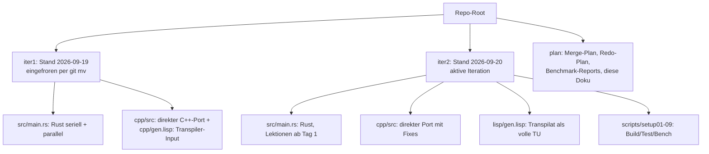
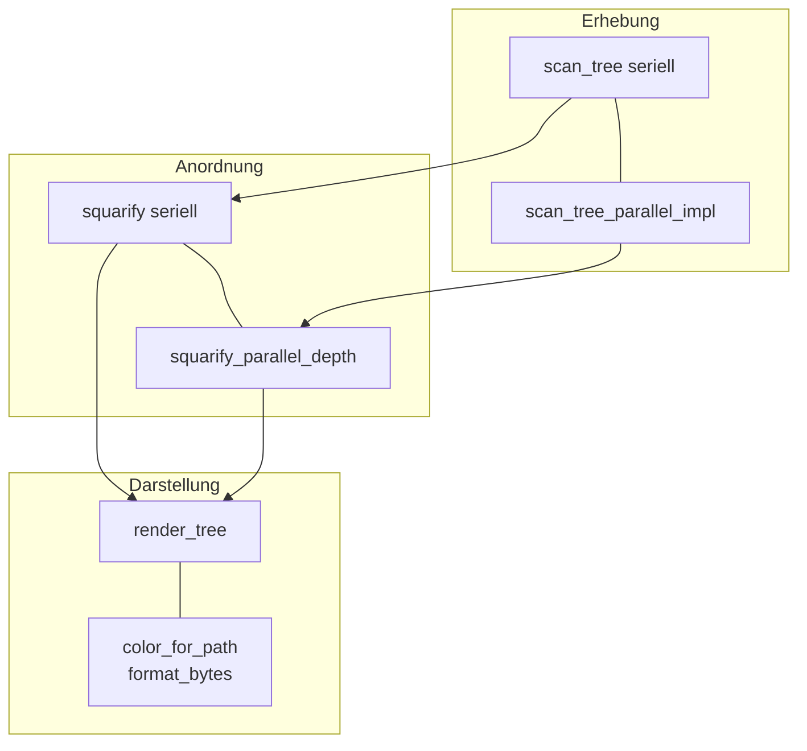
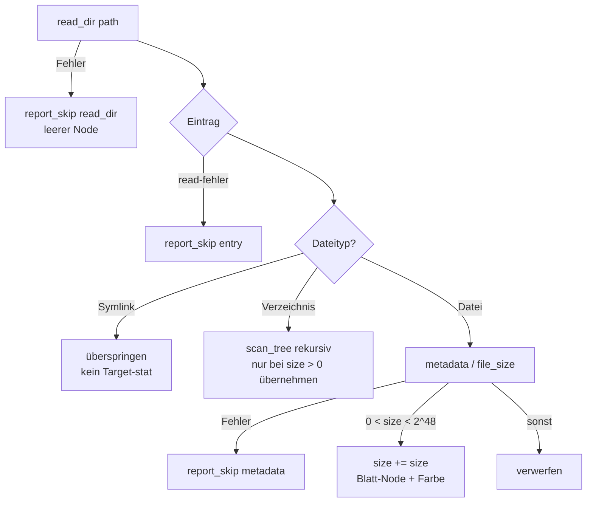
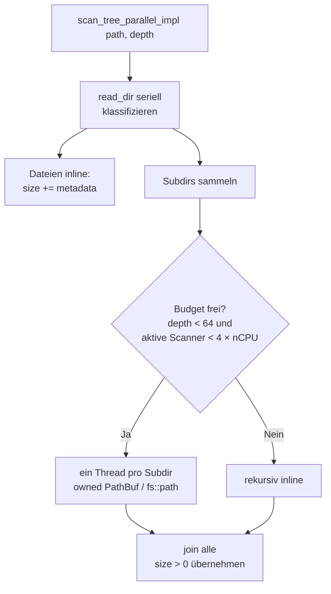
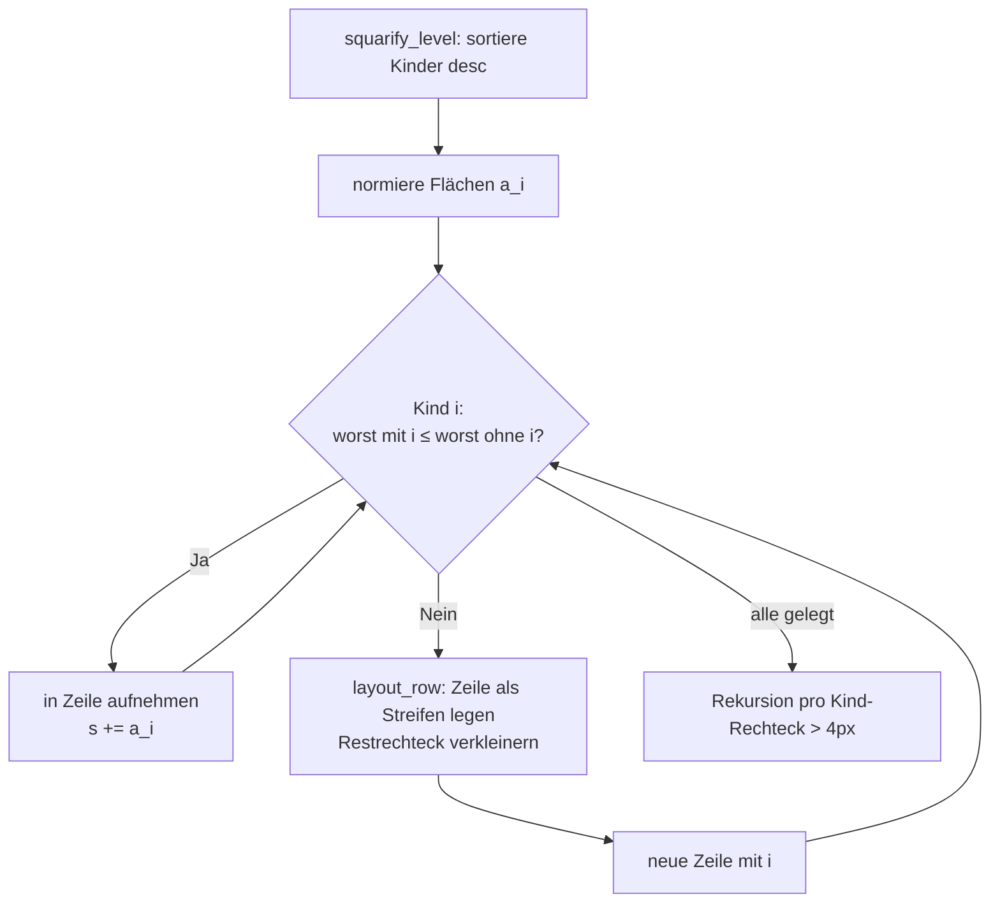
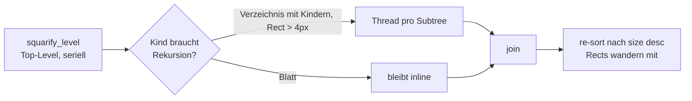

# Treemap-Disk-Visualizer: Architektur, Datenerhebung, Layout und Benchmarks

Diese Dokumentation beschreibt die Code-Experimente in diesem Repository:
einen Festplatten-Visualisierer, der Verzeichnisbäume vermisst und als
Treemap zeichnet. Es gibt zwei Iterationen (`iter1/`, `iter2/`) mit je einer
Rust-Implementierung und zwei C++-Implementierungen (eine direkt portiert,
eine per Lisp transpiliert) — insgesamt vier Programme, die dasselbe tun,
sowie die Benchmark-Experimente, mit denen die Parallelisierung entworfen
wurde.

**Leserführung.** § 1 erklärt, was das Programm für den Anwender tut und wie
das Repository organisiert ist. § 2 definiert die gemeinsame Architektur
aller vier Programme und arbeitet dann die Unterschiede heraus: erst
Rust vs. C++ (§ 2.1), dann Iteration 1 vs. 2 (§ 2.2). § 3 und § 4 sind das
Herzstück: die Datenerhebung (Filesystem-Scan, seriell und parallel) und das
Treemap-Layout (Algorithmus, Parallelisierung, Darstellung). § 5 prüft anhand
der Benchmarks, ob die Entwurfsannahmen hielten, und beantwortet, ob die
Architektur für große Dateisysteme taugt. Fachbegriffe und Funktionsnamen
werden dort erklärt, wo sie zuerst vorkommen; ein Glossar gibt es nicht —
jede Sektion nimmt den Leser von Neuem an die Hand.

**Scope.** Abgedeckt sind Architektur, Scan, Layout und Benchmarks aller vier
Programme. Nicht abgedeckt sind GUI-Interna (dazu nur § 4.3 im Überblick)
und die Lisp-Emitter-Details des Transpilers — dafür sei auf die
Walkthroughs verwiesen. Quellennachweise stehen zu Beginn jeder Sektion.

Quellen im Repo: [iter1/src/main.rs](../../../iter1/src/main.rs),
[iter2/src/main.rs](../../../iter2/src/main.rs),
[iter1/cpp/src](../../../iter1/cpp/src),
[iter2/cpp/src](../../../iter2/cpp/src),
[iter2/lisp/gen.lisp](../../../iter2/lisp/gen.lisp),
Walkthroughs und Reports unter
[plan/20260919_01_merge](../../20260919_01_merge/walkthrough.md) und
[plan/20260920_01_redo](../../20260920_01_redo/walkthrough.md).

---

## 1. Überblick: Was das Programm tut

Der Treemap-Disk-Visualizer beantwortet eine einzige Frage — *„Wohin ist der
Plattenplatz gegangen?"* — und beantwortet sie grafisch: Er misst die Größen
aller Dateien unter einem Startverzeichnis und zeichnet sie als
**Treemap**, eine von Ben Shneiderman erfundene Darstellung, in der jedes
Rechteck für eine Datei (oder ein Verzeichnis) steht und seine Fläche
proportional zur Byte-Größe ist. Große Rechtecke sind große
Speicherfresser; Verschachtelung zeigt die Verzeichnishierarchie.

Das Programm kennt drei Betriebsarten. Zwei davon laufen ohne Fenster —
das ist Absicht: So lassen sich Scan-Korrektheit und Geschwindigkeit auf
Servern und im CI testen, ganz ohne Grafiksystem. Nur die dritte öffnet ein
Fenster:

| Modus | Befehl | Verhalten |
|---|---|---|
| Scan (headless) | `--scan <dir>` | misst den Baum und druckt eine Zeile, z. B. `/usr: 10.5 GB in 200000 files`. „Broken-Pipe-sicher" heißt: Wird die Ausgabe in `head` gepipt und früh geschlossen, stürzt das Programm nicht ab, sondern beendet sich still. |
| Benchmark | `--bench <dir>` | misst 5 Runden lang seriellen gegen parallelen Scan *und* Layout, druckt die Zeiten und bricht per Assert ab, falls beide Pfade unterschiedliche Gesamtgrößen liefern („Paritäts-Assert"). |
| GUI | `<binary> [dir]` | scannt parallel in einem Hintergrund-Thread, zeichnet die Treemap und zeigt unter dem Mauszeiger `Pfad (Größe)` an („Hover"). |

Der Datenfluss ist in allen vier Programmen identisch und streng
sequenziell — erst messen, dann anordnen, dann ausgeben oder zeichnen:

**Warum zwei Iterationen?** Iteration 1 (September 2026, Plan
`20260919_01_merge`) war das Experimentierfeld: Hier wurden Rust-Programm,
C++-Port und Transpiler-Input geschrieben — und hier schlugen die Benchmarks
zu (falsche Granularität, fehlende Budgets, siehe § 5.1). Iteration 2 (Plan
`20260920_01_redo`) fror iter1 per `git mv` ein und schrieb alles neu, mit
den gelernten Lektionen von der ersten Zeile an. Das folgende Diagramm zeigt
die Ablage; die Tabelle danach ordnet ein, was sich geändert hat. Begriffe
wie „Cap" (Thread-Budget), „Fan-out" (Auffächerung in Threads) oder
„Translation Unit" (eine vollständig kompilierbare C++-Übersetzungseinheit)
werden in § 2–4 definiert — die Tabelle dient hier nur der Orientierung:

| Aspekt | Iteration 1 (`iter1/`) | Iteration 2 (`iter2/`) |
|---|---|---|
| Rust | serieller Referenz-Scan plus parallele Variante mit `thread::scope`; Thread-Budget (Cap) erst per Benchmark nachgerüstet | gleiche Algorithmen, aber Cap, Tiefenbegrenzung und Helferfunktionen von Anfang an |
| C++ direkt | Port mit 3 Systemaufrufen pro Datei und unbegrenzter Thread-Erzeugung, beides per Benchmark gefixt | Fixes übernommen: 1 Systemaufruf pro Datei, Pfade als Kopie statt Referenz, eigener `needs_recursion`-Helfer |
| C++ generiert | Lisp-Transpiler-Input, nur auf Syntax geprüft, mit ungeprüften Defekten | vollständige, kompilierbare Einheit, per Test byte-identisch zum Hand-Port |
| Tests | Unit-Tests + Headless-Tests | zusätzlich Kantenfall-Tests (fehlendes Verzeichnis, geschlossene Pipe) und Paritätstests; Build-/Test-/Bench-Skripte `setup01`–`setup09` |
| Benchmarks | synthetisches Fixture plus ein großer Baum | Fixture plus drei reale Bäume (`/workspace`, `/root`, `/usr`) mit eigenem Rust↔C++-Report |

---

## 2. Architektur: drei Schichten, zwei Sprachen, ein Vertrag

Alle vier Programme — Rust und C++ in je zwei Iterationen — implementieren
denselben Bauplan. Das war eine bewusste Entwurfsentscheidung: Wer den
Rust-Code versteht, findet sich im C++-Code Zeile für Zeile wieder, weil
jede Funktion ein benanntes Gegenstück hat. Dieser Abschnitt definiert den
gemeinsamen Vertrag und erklärt jede beteiligte Funktion in ihrer Rolle.

**Die zentrale Datenstruktur** ist `Node` — ein Baumknoten mit sechs
Feldern: `path` (zugehöriger Dateipfad), `size` (aufsummierte Byte-Größe des
Subtrees), `is_dir` (Verzeichnis oder Datei), `children` (Kindknoten),
`rect` (zugewiesenes Bildschirmrechteck — wird erst vom Layout in § 4
gefüllt) und `color` (Darstellungsfarbe — wird schon beim Scan aus dem
Dateinamen abgeleitet, siehe § 4.3). Entscheidend ist die
Eigentumsdisziplin: Der Baum besteht aus *Owned Values*, also Werten, die
genau einem Besitzer gehören und an Threads *übergeben* (nicht gemeinsam
benutzt) werden. Dadurch braucht kein Thread Sperren: Was ein Thread
bearbeitet, gehört ihm allein.

Der Vertrag hat drei Schichten plus eine Fehlerkonvention:

- **Erhebung (Scan):** `scan_tree` öffnet *ein* Verzeichnis, klassifiziert
  jeden Eintrag und kehrt mit dem vermessenen Subtree zurück; `scan_entry`
  entscheidet für *einen einzelnen* Eintrag (Verzeichnis? Datei? Symlink?
  Fehler?) und ruft sich für Unterverzeichnisse rekursiv auf. Das ist der
  serielle Referenzpfad — das Maß aller Dinge, an dem sich die parallele
  Variante messen lassen muss.
- **Anordnung (Layout):** `squarify` ist der Treiber, der den Treemap-
  Algorithmus auf jede Baumebene anwendet; `squarify_level` ordnet die
  Kinder *einer* Ebene als Rechteckzeilen an (das Verfahren aus § 4);
  `worst` bewertet dabei, wie „unquadratisch" eine Zeile gerade ist, und
  `layout_row` legt eine fertige Zeile als Streifen auf den Bildschirm.
- **Darstellung:** `render_tree` zeichnet den Baum rekursiv und erkennt
  nebenbei, unter welchem Rechteck die Maus steht (Hover);
  `color_for_path` bestimmt die Farbe einer Datei aus ihrer Endung oder —
  als Fallback — aus einem Hash ihres Namens; `format_bytes` verwandelt
  Byte-Zahlen in lesbare Angaben wie `10.5 GB`.
- **Parallele Pfade:** `scan_tree_parallel_impl(path, depth)` und
  `squarify_parallel_depth(nodes, rect, depth)` implementieren dieselben
  Algorithmen wie ihre seriellen Geschwister, verlagern aber ganze Subtrees
  als Owned Values in Threads. Der `depth`-Parameter zählt die
  Rekursionstiefe und begrenzt die Auffächerung (Details in § 3.3 und § 4.2).
- **Fehlerkonvention:** Genau eine Meldefunktion, `report_skip`, schreibt
  jede übersprungene Stelle (unlesbares Verzeichnis, verschwundene Datei)
  einmal nach stderr. Auf den E/A-Pfaden gibt es kein `unwrap` (Rust) und
  keine Exceptions (C++): Fehler sind Werte, die gemeldet und dann mit
  sinnvollen Defaults weiterverarbeitet werden.

Das folgende Diagramm zeigt, wie die Schichten aufeinander aufbauen — oben
die Erhebung, in der Mitte die Anordnung, unten die Darstellung; links der
serielle Referenzpfad, rechts sein paralleles Gegenstück:

### 2.1 Wie Rust und C++ denselben Vertrag erfüllen

Die Regel lautet: Jede Rust-Funktion hat ein 1:1-Gegenstück mit
snake_case-Namen (Kleinbuchstaben mit Unterstrichen, auch im C++-Code —
stilistisch unüblich, aber so lassen sich beide Dateien nebeneinander
lesen). Was dabei *anders* gemacht werden musste, zeigt die Tabelle. Sie
setzt einige Begriffe voraus, die hier kurz erklärt seien: Ein
*Borrowchecker* ist Rusts Compilezeit-Prüfer, der beweist, dass kein Speicher
gleichzeitig veränderbar geteilt wird. Ein *Scope* im Thread-Sinn ist ein
Rahmen, der garantiert, dass alle gestarteten Threads vor seinem Ende
beendet (gejoint) sind. `d_type` ist eine Kernel-Auskunft über den
Dateityp, die beim Verzeichnislesen gratis mitfällt. `error_code` ist C++s Art,
Fehler als Rückgabewert statt als Exception zu transportieren.

| Mechanismus | Rust | C++ (beide Iterationen) |
|---|---|---|
| Thread-Rahmen | `std::thread::scope` beendet alle Threads automatisch am Scope-Ende | `std::vector<std::thread>` plus handgeschriebene Join-Schleife im selben Scope — ohne frühe Returns, sonst liefen Threads auf zerstörte lokale Variablen |
| Thread-Budget | implizit durch den Scope-Typ begrenzt | handgeschrieben: ein atomarer Zähler (`ScanWorkersActive`) gegen ein Limit von $4 \times \text{nCPU}$ |
| Fehler | `Result`-Typ zwingt den Aufrufer zur Behandlung | `std::error_code` als Ausgabeparameter an jeder Filesystem-Stelle; jede Stelle prüft und meldet über `report_skip` (Ausgabe per Mutex serialisiert). Eine vergessene Prüfung läuft mit Default-Werten weiter statt zu stoppen. |
| Eigentum über Threads | der Borrowchecker *beweist* zur Compilezeit, dass Threads disjunkte Daten haben | `std::move` übergibt Subtrees plus disjunkte Ergebnisfächer (`results[i]`-Slots); nichts davon prüft der Compiler — die Korrektheit steckt in der Join-Reihenfolge |
| Dateityp-Abfrage | `file_type()`: dank `d_type` ganz ohne zusätzliche Systemaufrufe | `is_symlink` / `is_directory` / `is_regular_file` nutzen den Cache der Standardbibliothek: 1 Systemaufruf pro Datei. Die Lehre aus iter1: eine naive Kette aus `status()`-Aufrufen kostete 3 Systemaufrufe pro Datei (Details in § 3.2). |
| Ordnung nach Join | `sort_unstable_by_key(Reverse(size))` stellt die Größenordnung wieder her | `std::sort` nach dem Join — nötig, weil Threads in Fertigstellungsreihenfolge (nicht Größenreihenfolge) zurückkehren; die Rechtecke „wandern" bei der Sortierung einfach mit |
| GUI-Backend | macroquad (Rust-Spiele-Bibliothek) | olcPixelGameEngine, als Header-Datei ins Repo kopiert („vendored"), angebunden über `030_pge_app.hpp` |

**Zur Sicherheit:** C++ *erbt* keine einzige Rust-Garantie — gleiche
Struktur verkleinert nur die zu prüfende Fläche (Review-Fläche). Ersetzt
wird der Borrowchecker durch drei Maßnahmen: strikte Eigentumsdisziplin im
Stil (nie geteilte veränderbare Referenzen über Thread-Grenzen), bezahlte
Laufzeitprüfer (AddressSanitizer/UBSan laufen in jedem Test — sie sind 3–5×
langsamer, weshalb alle Bench-Zahlen in § 5 für sanitizer-freie Builds
gelten) und Byte-Paritätstests (`--scan` muss in allen drei Binaries
byte-identisch ausgeben).

### 2.2 Unterschiede Iteration 1 → 2 im Code

Iteration 2 ändert keinen Algorithmus — sie gießt die iter1-Lektionen in
Code, der von der ersten Zeile an richtig ist. Auf Rust-Seite heißt das
vor allem Herausfaktorieren: `is_virtual` kapselt den
`/proc|/sys|/dev`-Ausschluss, `dir_node` baut einen leeren
Verzeichnisknoten, `file_node` baut (oder verwirft) einen Dateiknoten nach
der Größenregel — drei Helfer, die iter1 inline wiederholte. Cap und
Tiefenbegrenzung sind keine nachträglichen Fixes mehr, sondern stehen von
Beginn an im Code. Auf C++-Seite sind vier Änderungen sichtbar:

1. **Pfade als Kopie statt Referenz** (`010_scanner.hpp`): iter1 schrieb
   `const fs::path& p = entry.path();` — eine Referenz auf Interna des
   Verzeichnis-Iterators. Legal, aber jede spätere Schleifen-Refaktorierung
   hätte daraus einen baumelnden Verweis (Dangling Reference) machen können.
   iter2 kopiert (`const fs::path p = entry.path();`), auf seriellem wie
   parallelem Pfad. Die Tidy-Regel `bugprone-dangling-handle` (ein
   Clang-Prüfer, der genau diese Muster findet) bleibt Pflicht.
2. **`ScanWorkerLimit` ohne Underflow-Falle:** iter1 verrechnete die
   Prozessorkern-Anzahl (`hardware_concurrency()`) mit vorzeichenloser
   Arithmetik, bei der der Spezialfall „unbekannt = 0" leicht falsch
   abbiegt; iter2 liest den Wert erst in eine lokale Variable und sichert
   den Nullfall explizit ab.
3. **`needs_recursion`-Helfer** (`020_layout.hpp`): Die vierfache Bedingung
   „Verzeichnis, nicht leer, Rechteck breiter und höher als 4 Pixel" stand
   an jeder Verzweigung; jetzt steht sie einmal an einem Ort.
4. **Transpilat als vollständige Einheit:** Das iter1-Generat wurde nur auf
   Syntax geprüft (`g++ -fsyntax-only`) und trug ungeprüfte Defekte. Das
   iter2-Generat kompiliert in beiden CMake-Profilen, besteht `ctest` und
   ist `--scan`-byte-identisch zum Hand-Port. Dabei fand ein Test einen
   echten Transpiler-Bug: `defstruct0` (die Lisp-Form, die C++-Structs
   erzeugt) ignorierte Initialwerte kommentarlos — `isDir` hatte keinen
   Default, und ein fehlendes Verzeichnis meldete `in 1 files` statt
   `in 0 files`. Fix: explizite Zuweisung im Emitter (der Lisp-Funktion,
   die den C++-Code schreibt); ein Paritätstest sichert das dauerhaft ab.

---

## 3. Datenerhebung: der Filesystem-Scan

Der Scan ist die einzige Schicht, die das Betriebssystem berührt — und die
einzige, deren Laufzeit zählt: Das Layout rechnet in Millisekunden, der Scan
in Zehntelsekunden bis Sekunden (siehe § 5). Wer die Performance des
Programms verstehen will, muss also den Scan verstehen. Sein Konzept ist in
allen vier Programmen gleich und besteht aus drei Ideen: einem seriellen
Referenzlauf, der die Wahrheit definiert (§ 3.1); der Lektion, dass die
Dateityp-Abfrage über Sieg oder Niederlage entscheidet (§ 3.2); und einer
parallelen Variante, die nur dort Threads einsetzt, wo sie sich lohnen
(§ 3.3).

### 3.1 Serieller Referenz-Scan: die Wahrheit, einfach hingeschrieben

Der serielle Scan ist bewusst naiv gehalten — er ist die Referenz, gegen die
alle Optimierungen auf Korrektheit geprüft werden. `scan_tree(path)` öffnet
*ein* Verzeichnis (Rust: `fs::read_dir`, C++: `fs::directory_iterator`),
klassifiziert jeden Eintrag einzeln und kehrt mit dem fertig vermessenen
Subtree zurück. Die Klassifizierung eines Einzeleintrags übernimmt
`scan_entry`: Sie fragt den Dateityp ab, verfolgt keine Symlinks, liest bei
Dateien die Größe aus den Metadaten (Rust: `entry.metadata()`, C++:
`entry.file_size(ec)`) und ruft sich für Unterverzeichnisse rekursiv auf.
Die Größen werden von unten nach oben (bottom-up) aufsummiert: Ein
Verzeichnis wird nur dann in seinen Elternknoten übernommen, wenn seine
aufsummierte Größe $> 0$ ist; leere Dateien (`size == 0`) und absurde
Größen ($\geq 2^{48}$) fallen heraus. Das folgende Diagramm zeigt den
Entscheidungsbaum pro Eintrag:

Drei Filter in diesem Baum sind semantisch, nicht kosmetisch:

- **Symlinks werden nie verfolgt** — sonst drohen Zyklen und doppelt
  gezählte Bäume. Entscheidend ist die Reihenfolge: Der Symlink-Test läuft
  *vor* jedem Zugriff auf das Link-Ziel (Rusts `file_type()` löst ohnehin
  nicht auf; C++ prüft `is_symlink` zuerst).
- **`/proc`, `/sys` und `/dev` sind ausgenommen** (Helfer `is_virtual` in
  iter2): Das sind virtuelle Bäume, die sich während des Lesens ändern und
  praktisch unendlich tief sind.
- **Fehler sind Werte, kein Abbruch:** Jede E/A-Stelle meldet über
  `report_skip` genau einmal nach stderr und läuft mit Defaults weiter. Die
  Probe aufs Exempel: `--scan` auf ein fehlendes Verzeichnis liefert
  `0.0 B in 0 files` bei Exit-Code 0 — kein Absturz, keine Exception.

### 3.2 Der Single-Stat-Punkt: warum der C++-Port erst langsam war

Der teuerste Unterschied zwischen den Sprachen steckt in *einer* Zeile der
`scan_entry`-Funktion: der Dateityp-Abfrage. Zum Verständnis: Ein
*Systemaufruf* (Syscall) ist ein Wechsel vom Programm in den Kernel — wenige
Mikrosekunden pro Stück, aber bei hunderttausenden Dateien summiert sich
jeder überflüssige Aufruf linear. Rusts `file_type()` kostet null
zusätzliche Syscalls, weil der Kernel den Dateityp (`d_type`) beim
Verzeichnislesen gratis mitliefert. Der erste C++-Port fragte dagegen naiv
drei Statusfunktionen pro Datei ab (`status()` + `symlink_status()` +
Größe) — **3 Stats pro Datei**, per `strace` (einem Syscall-Mitschreiber)
belegt: 13.421 Systemaufrufe vorher, 6.264 nachher. Folge: **5,6× langsamer**
als Rust. Der Fix nutzt den Typ-Cache der C++-Standardbibliothek
(`is_symlink` / `is_directory` / `is_regular_file`) und kommt mit **1 Stat
pro Datei** aus — danach herrscht Parität. Als Merksatz:

$$
\text{Scan-Zeit} \approx N_{\text{Einträge}} \times
(\text{Syscalls pro Eintrag}) \times t_{\text{Syscall}} +
\text{Thread-Overhead}
$$

Bei $N$ im Hunderttausender-Bereich dominiert der erste Term alles —
jede überflüssige `stat`-Familie kostet linear. Diese Formel ist auch der
Schlüssel zu § 5: Sie erklärt, warum der Scan VFS-gebunden (also durch das
Dateisystem, nicht die CPU begrenzt) ist.

### 3.3 Paralleler Scan: Dateien inline, Threads pro Verzeichnis

Die Granularitätswahl — also die Frage, *welche* Arbeit einen eigenen Thread
bekommt — ist das zentrale Ergebnis der iter1-Benchmarks: **Ein Thread pro
Datei war 12× langsamer** (0,009 s → 0,108 s auf dem Test-Fixture). Der
Grund ist ökonomisch: Dateien sind billig (ein `stat`), Verzeichnisse sind
teuer (ganze Subtrees dahinter). Deshalb behandelt die parallele Variante
`scan_tree_parallel_impl` Dateien **inline** (im laufenden Thread) und
fächert nur über **Unterverzeichnisse** auf. Jede Ebene liest ihre
Eintragsliste weiterhin seriell — nur die dabei gesammelten Subtrees laufen
nebenläufig, jeweils mit ihrem Pfad als Owned Value im Gepäck:

Zwei Bremsen verhindern die Thread-Explosion: Der `depth`-Parameter zählt
die Rekursionstiefe (Deckel bei 64), und ein globaler Zähler (`SCAN_ACTIVE`
in Rust, `ScanWorkersActive` in C++) erlaubt nur $4 \times \text{nCPU}$
gleichzeitig scannende Threads — wer kein Budget bekommt, rekursiert einfach
seriell weiter. Die Zahl 4 ist empirisch: **Unbegrenztes Erzeugen von
Threads maß auf warmem Cache 0,97×** — Parallelität ohne Budget war
langsamer als gar keine. Implementiert ist das in Rust mit `thread::scope`
über Owned Values, in C++ mit `std::thread`s und disjunkten
Ergebnisfächern (`results[i]`-Slots) plus Join-Schleife im selben Scope.

Formal gilt für den erreichbaren Speedup $S$ mit $p$ Worker-Threads und
seriellem Listen-Anteil $s$ die Amdahl-Grenze:

$$
S(p) = \frac{T_{\text{seriell}}}{T_{\text{parallel}}} \le
\frac{1}{s + \frac{1 - s}{p}}, \qquad
\lim_{p \to \infty} S(p) = \frac{1}{s}
$$

Da jede Verzeichnisebene seriell gelistet wird und der Scan VFS-gebunden
ist (nicht CPU-gebunden), ist $s$ groß — $S \approx 1{,}5$–$2{,}5$ ist das
erwartbare Optimum dieser Architektur, keine 8× (der Beleg folgt in § 5).

---

## 4. Layout: aus Größen werden Rechtecke

Nach dem Scan kennt das Programm für jeden Knoten eine Zahl (die Größe),
aber noch kein Bild. Das Layout löst das Übersetzungsproblem *Zahlen →
Rechtecke*: Es teilt den Bildschirm so auf, dass jede Datei ein Rechteck
erhält, dessen Fläche proportional zu ihrer Größe ist, und Verzeichnisse
ihre Kinder als verschachtelte Rechtecke enthalten. Das Verfahren folgt
Bruls, Huizing und van Wijk („Squarified Treemaps", 2000): Statt simple
Streifen zu legen, ordnet es die Kinder zeilenweise so an, dass die
Rechtecke möglichst **quadratisch** bleiben — quadratische Flächen lassen
sich vom Auge weit besser vergleichen als lange, dünne Streifen. Dieser
Abschnitt erklärt zuerst die Kernidee mit Formel (§ 4.1), dann ihre
Parallelisierung (§ 4.2) und schließlich Farbe, GUI und Hover (§ 4.3).

### 4.1 Die Kernidee: Zeilen, die möglichst quadratisch bleiben

Der Algorithmus arbeitet pro Baumebene in zwei Schritten. Zuerst sortiert
`squarify_level` — die Funktion, die *eine* Ebene anordnet — alle Kinder
absteigend nach Größe und rechnet ihre Byte-Größen in Bildschirmflächen um
(Flächen-Normierung, siehe Formel unten). Dann baut sie zeilenweise: Für
jedes Kind prüft die Bewertungsfunktion `worst` (C++: `worst_aspect`), ob
die laufende Zeile durch Aufnahme des Kindes „unquadratischer" würde —
falls ja, wird die fertige Zeile als Streifen auf den Bildschirm gelegt
(`layout_row` legt einen Streifen der Dicke $s / W$ entlang der kurzen
Rechteckseite) und eine neue Zeile begonnen. Ist alles verteilt, ruft der
Treiber `squarify` das Verfahren rekursiv für jedes Verzeichnis-Rechteck
auf, das größer als 4 Pixel ist — kleinere Rechtecke lohnen keine weitere
Unterteilung.

Die Bewertung „wie unquadratisch" ist die folgende Formel. Sei $W$ die kurze
Seite des Restrechtecks, $s$ die Flächensumme der aktuellen Zeile und $a_i$
die (normierte) Fläche von Kind $i$. Das schlechteste Seitenverhältnis der
Zeile ist:

$$
\mathrm{worst}(Zeile) = \max_i \;
\max\!\left( \frac{W^2 \cdot a_i}{s^2},\, \frac{s^2}{W^2 \cdot a_i} \right)
$$

Anschaulich: Jeder Bruch misst, wie weit ein Rechteck vom Quadrat (Verhältnis
1) entfernt ist — in beide Richtungen (zu breit, zu hoch). Ein Kind kommt
genau dann in die laufende Zeile, wenn es $\mathrm{worst}$ **nicht
verschlechtert**. Die Flächen-Normierung davor lautet:

$$
a_i = \mathrm{size}_i \cdot \frac{W_{\text{canvas}} \cdot H_{\text{canvas}}}
{\sum_j \mathrm{size}_j},
\qquad \sum_i a_i = W_{\text{canvas}} \cdot H_{\text{canvas}}
$$

Das heißt: Die Summe aller Kind-Rechtecke füllt den Bildschirm bis auf
Rundung exakt aus — das Layout ist **flächentreu** (per Test abgesichert:
Abweichung unter 0,5 %). Das folgende Diagramm fasst den Zeilenpass
zusammen:

### 4.2 Paralleles Layout: nur die oberste Ebene fächert auf

Der Zeilenpass aus § 4.1 ist inhärent seriell: Jede Aufnahme-Entscheidung
hängt vom aktuellen Restrechteck ab, also von allen Vorgängern. Parallel
läuft deshalb nur der zweite Schritt — die **Rekursion in die Subtrees**,
implementiert in `squarify_parallel_depth` mit Tiefenzähler `depth`. Und auch
das nur auf der obersten Ebene (`depth == 0`): Blätter ohne Rekursionsbedarf
bleiben inline, nur echte Subtrees (Verzeichnis, nicht leer, Rechteck größer
als 4 px — in C++ als Helfer `needs_recursion` gekapselt) wandern als Owned
Values in Threads; die Hilfsfunktion `layout_subtree_parallel` legt dort
je einen Subtree. Danach stellt ein Re-Sort die Größenordnung wieder her,
weil Threads in Fertigstellungsreihenfolge (nicht Größenreihenfolge)
zurückkehren — die bereits berechneten Rechtecke „wandern" bei der
Sortierung einfach mit:

Warum nur die oberste Ebene? Weil **unbegrenzter Fan-out auf jeder Ebene 5×
langsamer maß als seriell** (iter1-Bench): Das Layout ist
Millisekunden-Arbeit, und Thread-Erzeugung kostet mehr als sie einbringt.
Der parallele Layout-Pfad ist daher ehrlicherweise ein
Korrektheits-Parallelismus — er liefert *dieselben* Rechtecke wie seriell,
nur geringfügig schneller (auf großen Bäumen immerhin ~2×: 6 ms → 3 ms,
30 ms → 15 ms). Für den Gesamtspeedup ist er irrelevant; § 5 belegt das mit
Zahlen.

### 4.3 Darstellung: Farbe, Fenster, Hover

Drei kleine Bausteine vollenden das Bild — keiner betrifft die Architektur,
alle betreffen den Anwender:

- **Farbe** (`color_for_path`): Die Funktion ordnet Dateien nach Endung in
  vier Familien (Code grün, Bilder blau, Medien violett, Archive rot); alles
  andere erhält eine deterministische Farbe aus einem Hash des Dateinamens.
  „Deterministisch" heißt: dieselbe Datei, dieselbe Farbe — über alle vier
  Programme hinweg.
- **Fenster:** Die Rust-GUI nutzt macroquad, eine schlanke
  Rust-Spiele-Bibliothek; die C++-GUI nutzt die olcPixelGameEngine, deren
  Header-Datei ins Repo kopiert wurde („vendored") und über die Schale
  `030_pge_app.hpp` angebunden ist. Beide folgen demselben Ablauf: Der Scan
  läuft in einem Hintergrund-Thread, sein Ergebnis wandert über einen Kanal
  (Channel) in die Render-Schleife, und bei jeder Fenstergrößenänderung wird
  das Layout neu berechnet.
- **Hover:** `render_tree` zeichnet den Baum rekursiv und prüft nebenbei,
  unter welchem Rechteck die Maus steht; die Kopfzeile zeigt dann
  `Pfad (Größe)`. Der iter1-Hover-Bug — `root.rect` wurde im GUI-Thread nie
  gesetzt, sodass der Treffertest alles verwarf — ist in beiden Iterationen
  per Ein-Zeilen-Fix plus Screenshot-Verifikation dokumentiert.
- **Headless-Parität:** `--scan` gibt in Rust, direktem C++ und Generat
  **byte-identische** Zeilen aus — der stärkste Architektur-Test des Repos,
  weil er Scan, Filter und Summierung aller drei Binaries gleichzeitig prüft.

---

## 5. Benchmarks: haben sich die Annahmen bestätigt?

Was wurde eigentlich gemessen — und was bedeuten die Zahlen? Jede
`--bench`-Messung vergleicht auf demselben Baum den seriellen Referenzlauf
mit der parallelen Variante (je 5 Runden) und meldet den Speedup
$S = T_{\text{seriell}} / T_{\text{parallel}}$. Gemessen wurde auf zwei
Sorten Bäumen: einem synthetischen Fixture (40 Verzeichnisse à 100 Dateien
à 1 KiB = 4000 Dateien, 3,9 MB — deterministisch, per Skript reproduzierbar)
und realen Bäumen (`/workspace` 48,8 GB, `/root` 96,9 GB, `/usr` 10,5 GB).
Zwei Begriffe vorweg: „Warmer Cache" heißt, dass das Betriebssystem die
Verzeichnisdaten noch im Speicher hat und der zweite Lauf deshalb schneller
ist als der erste. „VFS-gebunden" heißt, dass das virtuelle Dateisystem
(also `readdir` + `stat`-Aufrufe), nicht die CPU der Engpass ist.

### 5.1 Initiale Annahmen (iter1, synthetisches Fixture)

| Implementierung | seriell | parallel | Speedup |
|---|---|---|---|
| Rust (`--release`) | ~7–10 ms | ~1–2 ms | ~4–5× |
| C++ direkt (Release) | ~45 ms | ~10–11 ms | ~4,2–4,6× |
| C++ generiert (`-O2`) | ~19 ms | ~2 ms | ~8–10× (warmer Cache) |

Dazu drei Lektionen, die die Parallelisierungs-Architektur aus § 3.3 und
§ 4.2 festlegten: Ein Thread pro Datei war 12× langsamer als Dateien inline
→ nur Subdirs bekommen Threads. Unbegrenztes Thread-Erzeugen maß auf warmem
Cache 0,97× (also Verlust) → Budget $4 \times \text{nCPU}$. Layout-Fan-out
auf jeder Ebene war 5× langsamer als seriell → nur Top-Level fächert auf.

### 5.2 Bestätigung auf realen Bäumen (iter2-Reports + eigene Messung)

Für diese Dokumentation wurden die Reports nicht nur zitiert, sondern auf
dieser Maschine (32 CPUs, je 5 Runden `--bench`) reproduziert:

| Baum | Rust seriell → parallel | Rust $S$ | C++ seriell → parallel | C++ $S$ |
|---|---|---|---|---|
| `/usr` (10,5 GB) | 0,20 → 0,19–0,21 s | 1,00–1,12× | 0,26 → 0,17 s | 1,47–1,59× |
| `/root` (96,9 GB) | 1,68 → 1,07–1,50 s | 1,12–1,57× | 2,57 → 1,04–1,44 s | 1,79–2,49× |

Das deckt sich mit den iter2-Reports (`report_bench_workspace.md`):
`/workspace` (48,8 GB) Rust 1,22–1,41× / C++ 2,07–2,43×;
`/root` Rust 1,15–1,74× / C++ 1,91–2,14×;
`/usr` Rust 1,00–1,06× / C++ 1,53–1,84×; Generat ≈ direkt überall.
**Die initialen Annahmen haben sich bestätigt — mit einer Korrektur:**

1. ✅ **Granularität schlägt Scheduler:** Die Fixture-Speedups (4–8×)
   skalieren nicht auf reale Bäume, aber die *Rangfolge der Designs*
   (Subdir-Threads + Cap + Top-Level-Layout) blieb überall optimal.
2. ⚠️ **Korrektur: Der Speedup schrumpft mit der Baumgröße und der
   Cache-Lage.** Auf warmem Cache und kleinen Bäumen frisst der
   Thread-Overhead den Gewinn auf (Rust auf `/usr`: 1,00×). Die 8–10× des
   generierten Codes waren ein warmer-Cache-Artefakt des Fixtures, kein
   Architekturvorsprung.
3. ✅ **C++ seriell ~1,5× hinter Rust** (Overhead von `std::filesystem`),
   **parallel Parität bzw. C++ vorn** — über alle drei Bäume stabil.
   Wahrscheinlichste Gründe: der `metadata()`-Stat pro Datei plus
   `thread::scope`-Overhead in Rust gegenüber d_type-Pfad und rohen
   `std::thread`s in C++.
4. ✅ **Layout ist irrelevant für den Gesamtspeedup** (Millisekunden gegen
   Zehntelsekunden bis Sekunden), überall ~2× — genau wie in § 4.2
   vorhergesagt.

### 5.3 Reicht die Architektur für große Dateisysteme?

**Ja — für den vorgesehenen Zweck, mit einer dokumentierten Grenze.**
97 GB scannen in ~1–1,5 s (parallel), die GUI lädt in dieser Zeit im
Hintergrund und bleibt interaktiv; `--scan` skaliert linear mit der
Eintragszahl. Der Engpass ist der VFS (`readdir` + 1 Stat pro Datei, jede
Ebene seriell gelistet), nicht die CPU — mehr Threads helfen jenseits des
Budgets nicht (Amdahl-Grenze aus § 3.3). Kein Redesign nötig, solange „ein
paar Sekunden beim Start" akzeptabel ist: Das ist ein interaktiver
Disk-Visualizer, kein Backup-Werkzeug.

Wann man überarbeiten müsste — und wie, falls es so weit kommt:

- **Millionen Dateien / Netzwerk-Dateisysteme:** Der serielle
  `read_dir`-pro-Ebene-Anteil $s$ dominiert irgendwann alles. Nächster
  Schritt wäre eine Work-Stealing-Warteschlange (statt
  Spawn-pro-Verzeichnis) plus gebündeltes `readdir` — nicht mehr Threads im
  aktuellen Schema.
- **Live-Aktualisierung:** Derzeit gilt Voll-Rescan bei jedem Start; eine
  inkrementelle Aktualisierung (`inotify`/`fanotify` plus Hochpropagieren
  geänderter Größen) wäre eine neue Schicht, kein Tuning.
- **`rayon`-Scheduler:** In beiden Walkthroughs als „nur bei Beleg"
  verworfen — zu Recht: Bei VFS-Bindung bringt ein Thread-Scheduler keine
  weitere Stufe.

---

## 6. Vorschlag-Box: was diese Doku zusätzlich bekam

Beim Schreiben fielen Themen auf, die das Dokument augenblicklich besser
machten — sie wurden direkt umgesetzt statt nur vorgeschlagen:

- **Entscheidungs-Flussdiagramme** (§ 3.1, § 3.3, § 4.1, § 4.2) statt
  reiner Prosa: Die Filter- und Fan-out-Regeln sind von Natur aus
  rautenförmig (Fallunterscheidungen) und lesen sich als Diagramm besser.
- **Formeln statt Adjektive** (§ 3.2 Scan-Kosten, § 3.3 Amdahl-Grenze,
  § 4.1 worst-Ratio und Flächentreue): „quadratisch" und „schnell genug"
  sind damit nachrechenbar statt behauptet.
- **Eigene Benchmark-Stichprobe** (§ 5.2): Die Reports wurden auf dieser
  Maschine (32 CPUs) mit `/usr` und `/root` reproduziert statt nur zitiert.
- **Noch offen (Vorschläge, nicht umgesetzt):** Cushion-Shading für
  plastischere Tiefe; `gen.lisp` auf `090_main.cpp`/`030_pge_app.hpp`
  ausweiten; TSan-Profil für die Slot-Disziplin; Tiefen-Baum-Lasttest
  (Stack-Verbrauch pro Thread).

